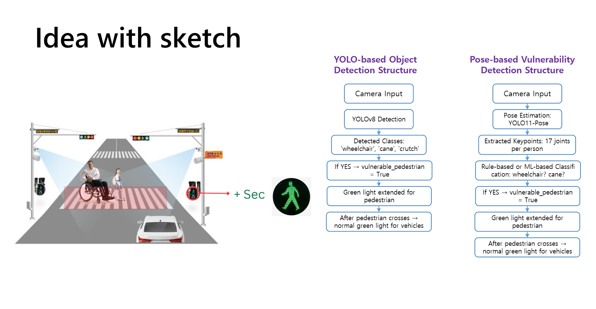

<h2>📌 Project Overview</h2>
<p align="center">
  
</p>


# SmartCare AI Light

SmartCare AI Light is an **AI-powered intelligent traffic light system** developed during the **SPIED 2025 International Workshop in China**.  
The system uses computer vision to detect **vulnerable pedestrians** — such as wheelchair or cane users — and **automatically extends the green light** until they have safely crossed.  
This not only improves **pedestrian safety** but also **optimizes traffic flow** for drivers.

---

## 📜 Background

This idea was inspired by a real-life experience:  
While helping a friend with a broken leg cross the street, we couldn’t make it before the light turned red.  
It raised the question: *Why don’t traffic lights give more time to those who really need it?*

SmartCare AI Light solves this problem by **detecting** and **responding** in real time.

This project was created by **Team OneAsia** (members from Korea, Japan, and China) during the **SPIED 2025 International Workshop held in China**.

---

## 🚀 Features

- **Real-time pedestrian detection** using CCTV/IP camera
- **Two AI-based methods**:
  1. **YOLO-based Object Detection** — Detects objects like wheelchairs, walking canes, or crutches
  2. **Pose-based Classification** — Uses human pose keypoints to detect mobility difficulty
- **Automatic traffic light control** to extend pedestrian green time
- **Traffic optimization**: Prevents wasted green light for drivers

---

## 🛠️ Technology Stack

- **Python 3**
- **OpenCV** — Camera video processing
- **YOLOv8 / YOLOv11-Pose** — Object detection & pose estimation
- **PyTorch** — Model training/inference
- **Raspberry Pi / Microcontroller** — Traffic light control (simulation or real-world)
- **Rule-based logic** or **ML classification** for decision-making

---

## 📂 Project Structure
```
SmartCare-AI-Light/
│
├── data/                     # Datasets and annotations
│   ├── raw/                   # Original (raw) datasets
│   ├── processed/             # Cleaned / augmented datasets
│
├── models/                   # YOLO and Pose-based model files
│   ├── yolo/                  # YOLO model configs and weight files
│   └── pose/                  # Pose-based model configs and weight files
│
├── scripts/                  # Main code files
│   ├── detect_yolo.py         # YOLO-based detection script
│   ├── detect_pose.py         # Pose-based detection script
│   ├── train_yolo.py          # YOLO model training script
│   ├── train_pose.py          # Pose-based model training script
│   └── utils.py               # Helper functions
│
├── utils/                    # Additional helper modules
│   ├── video_processing.py    # Video stream processing
│   ├── traffic_light_control.py # Traffic light control (simulation or real)
│
├── docs/                     # Documentation and diagrams
│   ├── system_diagram.png     # System diagram
│   └── presentation.pptx      # Project presentation slides
│
├── requirements.txt          # Python dependencies
├── README.md                 # Project overview
└── LICENSE                   # License file
```
---

## 🔄 How It Works

### YOLO-based Method
1. Camera captures crosswalk area
2. YOLO model detects objects: `wheelchair`, `cane`, `crutch`
3. If detected → extend pedestrian green light

### Pose-based Method
1. Camera captures crosswalk area
2. Pose estimation extracts body keypoints
3. Classification model or rule-based logic detects mobility difficulty
4. If detected → extend pedestrian green light

---

## 📌 Installation

```bash
# Clone the repository
git clone https://github.com/yourusername/smartcare-ai-light.git
cd smartcare-ai-light

# Install dependencies
pip install -r requirements.txt
```
▶️ Usage
bash
Copy
Edit
# Run YOLO-based detection
python detect_yolo.py

# Run Pose-based detection
python detect_pose.py
📊 Future Work
Integrate with real traffic light systems

Deploy on edge devices for real-time city use

Improve detection for occluded pedestrians

📜 License
This project is licensed under the MIT License.

🌍 Authors
Team OneAsia — SPIED 2025 International Workshop (China)
Members from Korea, Japan, and China

yaml
Copy
Edit

